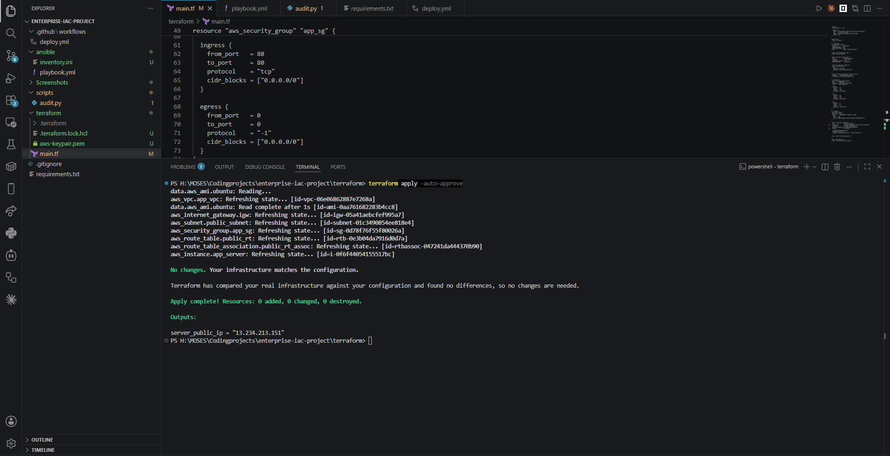
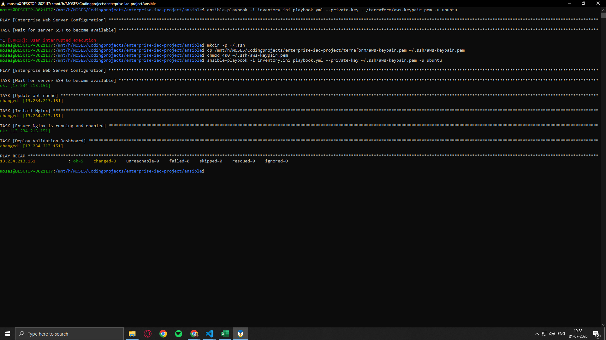
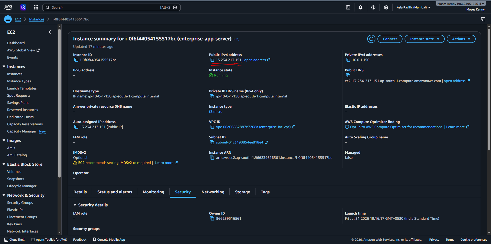
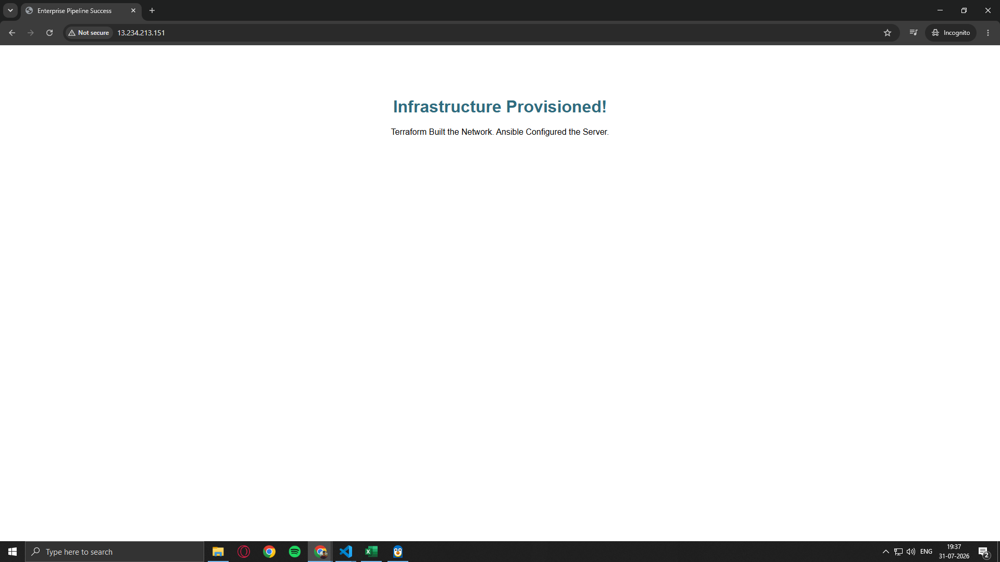

# 🚀 Automated Enterprise Cloud Infrastructure & Configuration Pipeline

An end-to-end Infrastructure as Code (IaC) and Automated Configuration Management pipeline. This project provisions production-grade AWS cloud infrastructure using **Terraform** and automatically configures a secure, high-performance web server using **Ansible**.

---

## 📌 Architecture Overview

```text
                        +-------------------------------------------------+
                        | AWS Cloud (ap-south-1)                         |
                        |                                                 |
                        |   +-----------------------------------------+   |
                        |   | VPC (10.0.0.0/16)                       |   |
                        |   |                                         |   |
                        |   |   +---------------------------------+   |   |
                        |   |   | Public Subnet (10.0.1.0/24)     |   |   |
                        |   |   |                                 |   |   |
                        |   |   |   +-------------------------+   |   |   |
  +--------------+      |   |   |   | EC2 Instance            |   |   |   |
  | Terraform    |----->|---|---|-->| (Ubuntu / Nginx)        |   |   |   |
  | (Provision)  |      |   |   |   +-------------------------+   |   |   |
  +--------------+      |   |   |                ^                |   |   |
                        |   |   |                | Configured by  |   |   |
  +--------------+      |   |   +----------------|----------------+   |   |
  | Ansible      |------|---|--------------------+                    |   |
  | (Config App) |      |   |                                         |   |
  +--------------+      |   +-----------------------------------------+   |
                        |                                                 |
                        +-------------------------------------------------+
```

### 📋 Key Components
1. **Infrastructure Provisioning (Terraform):**
   * Dedicated Virtual Private Cloud (VPC) with Internet Gateway attached.
   * Public Subnet configured with route table routing external internet traffic.
   * Fine-grained AWS Security Group rules restricting inbound traffic to `Port 22` (SSH) and `Port 80` (HTTP).
   * EC2 compute instance provisioned with dynamic inventory generation.

2. **Configuration Management (Ansible):**
   * Asynchronous health checks (`Wait for SSH`) ensuring remote availability prior to task execution.
   * Automated OS package index updates (`apt update`).
   * Automated web server provisioning (`Nginx`) and service state enablement (`systemd`).
   * Custom dashboard file deployment for live environment verification.

---

## 🛠️ Technology Stack

| Technology | Purpose |
| :--- | :--- |
| **AWS** | Cloud Service Provider (VPC, Subnets, EC2, Security Groups) |
| **Terraform** | Infrastructure as Code (Declarative Cloud Provisioning) |
| **Ansible** | Automated Configuration Management & Application Deployment |
| **Ubuntu Linux** | Target Host Operating System |
| **Nginx** | Enterprise Reverse Proxy & Web Server |
| **WSL 2 / PowerShell** | Local Execution Environment |

---

## 📸 Deployment & Verification Screenshots

### 1. Infrastructure Provisioning (`terraform apply`)
> Terraform successfully provisions the VPC, Subnet, Security Group, and EC2 instance, outputting the live public IP address.



---

### 2. Configuration Playbook Execution (`ansible-playbook`)
> Ansible logs into the newly provisioned instance over SSH, installs required dependencies, configures Nginx, and deploys the dashboard.



---

### 3. AWS Management Console Verification
> Cloud provider validation showing the provisioned EC2 instance active in the `ap-south-1` region.



---

### 4. Live Environment Verification
> Web browser accessing the public IP address displaying the live enterprise dashboard.



---

## 🚀 How to Run This Project Locally

### Prerequisites
* [Terraform v1.x+](https://developer.hashicorp.com/terraform/downloads) installed.
* [AWS CLI](https://aws.amazon.com/cli/) configured with valid Access and Secret keys.
* Linux environment or [WSL 2](https://learn.microsoft.com/en-us/windows/wsl/install) with **Ansible** installed (`sudo apt install ansible`).

---

### Step 1: Clone the Repository
```bash
git clone https://github.com/MosesKenny/enterprise-iac-project.git
cd enterprise-iac-project
```

### Step 2: Provision Infrastructure with Terraform
```bash
cd terraform
terraform init
terraform apply -auto-approve
```
*This step outputs the public IP of the EC2 instance and automatically generates the `inventory.ini` file for Ansible.*

### Step 3: Run Configuration Management with Ansible
From your WSL / Linux terminal:
```bash
# Secure SSH Key permissions
chmod 400 ~/.ssh/aws-keypair.pem

# Run Ansible Playbook
cd ../ansible
ansible-playbook -i inventory.ini playbook.yml --private-key ~/.ssh/aws-keypair.pem -u ubuntu
```

### Step 4: Access the Live Application
Open your browser and navigate to:
```text
http://<YOUR_EC2_PUBLIC_IP>
```

---

## 🧹 Infrastructure Teardown

To prevent unwanted cloud billing, tear down all provisioned resources with a single command:

```bash
cd terraform
terraform destroy -auto-approve
```

---

## 📝 Key Engineering Learnings
* Managed strict SSH permission paradigms across cross-platform execution environments (Windows NTFS vs Linux POSIX filesystems).
* Implemented dynamic inventory linkage between IaC provisioners and CM orchestrators (`local-exec` dynamic output).
* Handled burstable instance type selection (`t3.micro`) aligned with updated AWS regional Free Tier policies.
